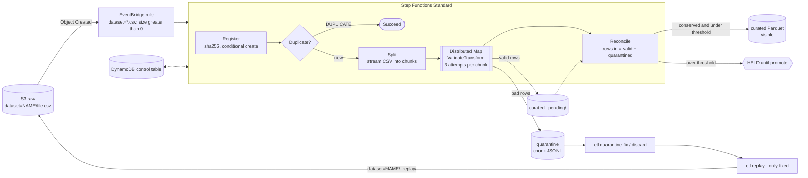

# etl-quarantine

Drop a CSV in a raw bucket. Every row is checked against a versioned JSON Schema. Good rows land as Parquet. Bad rows land in a quarantine you can inspect, fix and replay with one command. The pipeline proves that no row is lost or loaded twice, even when chunks crash and the same file arrives twice.

**1,000,000 rows, 18 injected chunk crashes and a duplicate delivery: 0 lost, 0 duplicated.** Counted by reading the Parquet and quarantine files back, not from counters. A 20-seed fault sweep conserved every row in 20 of 20 runs. Details are in [bench/RESULTS.md](bench/RESULTS.md), generated from [bench/results.json](bench/results.json). Throughput depends heavily on machine load: five runs on the same machine gave 9,667 to 44,768 rows/s (9,667, 15,013, 23,184, 35,950 and 44,768). The committed run is the 9,667 rows/s one, measured on the final commit while other jobs held the CPU at about 85%. The conservation results reproduced exactly in every run.

## 30 seconds

```sh
npm ci && npm run build
node dist/cli/main.js demo          # or: npm run demo
```

The demo is offline. It generates a seeded 50,000-row export with about 3% bad rows, ingests it with a crash injected into chunk 2, delivers the same bytes again, shows the quarantine histogram, fixes rows, replays them and prints a row-accounting table read back from disk. This is the real output of one run (timings vary by machine):

```text
etl demo: 50000 rows, seed 7, state in <temp dir>
1. generate a 50000-row customers export with about 3% bad rows
   1557 rows were generated bad
   (89 ms)
2. ingest it, crashing chunk 2 after it wrote its output
   status: LOADED_WITH_QUARANTINE
   sha: 5372608e3dfd9d7862f03389166909b0e57daa8ed928b6aa6e569232b4ffd39c
   rows in: 50000
   rows valid: 48443
   rows quarantined: 1557
   retried chunks: 2 (2 attempts)
   chunk 2: attempt 1 crashed, attempt 2 ok
   (2021 ms)
3. deliver the same bytes again as export-copy.csv
   status: DUPLICATE (already loaded from dataset=customers/customers.csv)
   (105 ms)
4. what is in quarantine (top 5 errors)
   count  path             keyword
   384    (row)            columnCount
   207    /contract_start  format
   203    /customer_id     pattern
   200    /currency        enum
   197    /plan            enum
   (2 ms)
5. fix the DD/MM/YYYY dates, discard rows with no customer_id
   example: etl quarantine fix 5372608e3dfd --row 203 --set contract_start=2024-04-15
   applied to 207 rows
   discarded 203 rows
   (5984 ms)
6. replay the fixed rows
   dataset=customers/_replay/5372608e3dfd9d7862f03389166909b0e57daa8ed928b6aa6e569232b4ffd39c-r1.csv: LOADED, 207 of 207 rows loaded
   parent rows: pending 1147, loaded 207, requarantined 0, discarded 203
   (554 ms)
7. row accounting, read back from the Parquet and quarantine files
   source rows        50000
   curated rows       48650
   still quarantined  1147
   discarded          203
   lost               0
   duplicated         0
   wall time          9.1 s
lost 0, duplicated 0
```

The 384 `(row) columnCount` rows are malformed rows with the wrong number of fields (a decimal comma in an unquoted amount splits the field). They cannot be fixed by setting one column, so the demo leaves them in quarantine.

## Architecture



`src/core` is pure (no AWS SDK, no file system; a test enforces it). Steps are plain async functions over two ports, `ObjectStore` and `ControlStore`. The same functions run behind Lambda handlers, behind the in-process driver (`src/pipeline/driver.ts`, which mirrors the state machine) and behind the CLI. Nothing is deployed in v0.1: the state machine is proven by CDK assertion tests and `cdk synth`, and the AWS adapters by an emulator suite.

## Invariants and the tests that prove them

| # | Invariant | Proof |
|---|---|---|
| I1 | `rowsIn == rowsValid + rowsQuarantined` per chunk and per file, otherwise `FAILED` and nothing visible | `test/core/accounting.property.test.ts` (fast-check), `test/pipeline/reconcile.test.ts`, golden fixtures, benchmark readback |
| I2 | No row reaches Parquet without passing the pinned schema | `test/core/validate.test.ts`, `test/pipeline/validate-transform.test.ts` (reads the Parquet back) |
| I3 | The same content is loaded at most once | `test/pipeline/register.test.ts`, `test/pipeline/driver.faults.test.ts`, `test/integration/aws-pipeline.int.test.ts` |
| I4 | Chunk retries are idempotent | `test/pipeline/driver.faults.test.ts` (crash after and before output), attempt-guarded count write in the control-store contract suite |
| I5 | Only approved fixes are replayed, and replays are fully revalidated | `test/pipeline/replay.test.ts` |
| I6 | An over-threshold file is invisible until promoted | `test/pipeline/reconcile.test.ts`, 20% golden fixture, `test/cli/commands.test.ts` |
| I7 | Every quarantined row is accounted for exactly once across replays | `test/core/lineage.property.test.ts`, two-generation test in `test/pipeline/replay.test.ts` |
| I8 | Input limits | `test/core/limits.test.ts`, `test/pipeline/split.test.ts`, `test/pipeline/register.test.ts` |
| I11 | Encryption and retention | `infra/test/storage.test.ts` |

I9 (schema diff gate) and I10 (Athena) are not in v0.1.

## CLI

State lives in `--root <dir>` (default `.etl`). `<sha>` accepts a unique prefix of at least 4 characters.

| Command | What it does |
|---|---|
| `etl ingest <file> --dataset customers [--key-name n] [--crash-after-output 2,5]` | copy a CSV to the raw bucket and run the pipeline |
| `etl status <sha>` | file record and chunk table |
| `etl files --dataset customers` | files, newest first |
| `etl quarantine ls <sha>` | error histogram and lineage states |
| `etl quarantine show <sha> --row N` | one quarantined record as JSON |
| `etl quarantine fix <sha> --row N --set col=value [--set ...]` | approve a correction (re-validated at replay) |
| `etl quarantine discard <sha> --rows 1,2,3 [--reason text]` | give up on rows |
| `etl replay <sha> [--only-fixed]` | build a replay file from open rows and ingest it |
| `etl promote <sha>` | make a `HELD` file visible |
| `etl curated count --dataset customers` | rows read back from Parquet and quarantine files |
| `etl demo [--rows 50000] [--seed 7] [--root dir]` | the tour above |

## Run, test, benchmark

```sh
npm ci
npm run typecheck
npm test                       # no network, Docker or credentials; integration files are skipped
npm run build
npm run synth                  # bundles the Lambdas, then cdk synth with cdk-nag checks
npm run smoke:pack             # pack, install the tarball, run etl --version and etl demo
npm run gates                  # typecheck, test, build, synth, smoke:pack
npm run it:up && npm run test:it && npm run it:down   # DynamoDB Local 3.3.1 + S3Mock 4.11.0 on 5340/5341
npm run bench                  # 1M rows + 20-seed sweep, writes bench/results.json and bench/RESULTS.md
```

## Testing

Real counts from the last runs on the build machine:

- `npm test`: 30 test files and 225 tests passed; 2 integration files (22 tests) skipped because `ETL_IT` is unset.
- `npm run it:up && npm run test:it` against DynamoDB Local 3.3.1 and S3Mock 4.11.0, from cold containers: 2 files, 22 tests passed in 85 s (the same adapter contract suites that run against memory and the file system, plus the pipeline on the AWS adapters). The emulators take about 30 s to start; the suite waits up to 120 s (`ETL_IT_WAIT_MS`).
- `npm run synth`: both stacks synthesize (`EtlQuarantineStorage` 14 resources, `EtlQuarantinePipeline` 25) with zero unacknowledged cdk-nag AwsSolutions violations. Each acknowledgement has a written reason in `infra/lib/nag-suppressions.ts`.
- `npm run bench`: see [bench/RESULTS.md](bench/RESULTS.md).

## Decisions

Each ADR lists what it gave up.

- [0001](docs/adr/0001-single-package-ports-and-adapters.md) One package with a pure core behind ports. Gave up: a separately versioned core library and a Construct Hub package.
- [0002](docs/adr/0002-in-process-driver-instead-of-localstack.md) An in-process driver mirrors the state machine, no LocalStack. Gave up: proof that the deployed state machine behaves like the driver (EventBridge timing, Distributed Map batching, Lambda limits and runtime IAM are untested).
- [0003](docs/adr/0003-parquet-with-hyparquet-writer.md) Parquet from a pure-JS writer. Gave up: streaming writes (a chunk is held in memory), the maturity of Arrow-based writers, and writer tuning.
- [0004](docs/adr/0004-normalise-validate-cast.md) Normalise, validate strings with Ajv, then cast. Gave up: typed JSON values in the schema (numbers, booleans), which JSONL input would need later.
- [0005](docs/adr/0005-idempotency-and-pending-prefix.md) Content-hash identity, deterministic keys, a `_pending/` prefix. Gave up: hashing a large file costs a full read, copy-then-delete doubles S3 writes for curated data, and the same row in two files is loaded twice (append-only).
- [0006](docs/adr/0006-local-stores-and-emulator-integration.md) File-backed local stores and an opt-in emulator suite. Gave up: the file control store is unsafe for two concurrent CLI processes and rewrites its JSON per mutation; the emulators are not AWS.
- [0007](docs/adr/0007-v0.1-scope-cuts.md) Replay is in; Glue, Athena and the LLM suggester are out. Gave up: the schema-diff gate (I9), the Athena scan cutoff (I10) and a cost-per-million-rows number.

## Known limits

- **Not deployed.** The in-process driver stands in for Step Functions; the stacks are only synthesized. No deployment-level numbers exist.
- No Athena or Glue, no LLM fix suggester, no JSONL input, no `etl schema diff` gate, no SNS or Slack alerts.
- The file control store is single-writer, and each mutation rewrites `control.json`; fixing hundreds of rows through it is slow (step 5 of the demo).
- Append-only: no upserts or primary-key de-duplication across files.
- A rejected file (unclosed quote, too many columns, header mismatch, over the size limit) fails whole, with the parser message, before anything is visible.
- A replay child whose own quarantine ratio exceeds the threshold is `HELD`, so its parent rows stay pending until you `promote` it.
- Replaying a ragged row (wrong field count) re-emits only the fields that were parsed; fix such rows by setting the columns explicitly.
- **No cost number is published:** nothing is deployed, so it cannot be measured.
