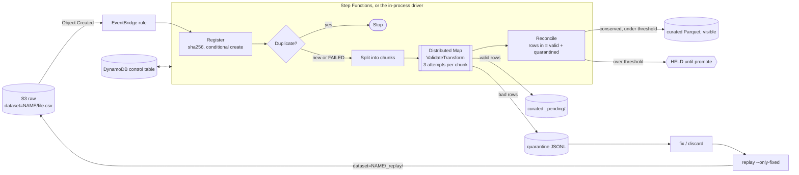

# etl-quarantine developer guide

## 1. What it is

etl-quarantine is an event-driven CSV pipeline with row-level quarantine.
You drop a CSV into a raw bucket.
Each row is checked against a versioned JSON Schema.
Good rows become Parquet. Bad rows go to a quarantine.
You can inspect quarantined rows, fix or discard them, and replay them with one command.
The pipeline checks that no row is lost or loaded twice, even when chunks crash or the same file arrives twice.

**Headline (measured, `bench/results.json`):** 1,000,000 rows, 18 injected chunk crashes and a duplicate delivery gave 0 lost rows and 0 duplicated rows.
The rows were counted by reading the Parquet and quarantine files back.
A 20-seed fault sweep kept every row in 20 of 20 runs.
Throughput depends on machine load. Five runs on the same machine gave 9,667 to 44,768 rows/s.

## 2. Five-minute quickstart

You need Node 22.12 or newer. You do not need Docker or AWS credentials.

```sh
cd etl-quarantine
npm ci
npm run build
node dist/cli/main.js demo                 # about 10 s, offline, prints "lost 0, duplicated 0"
```

The demo generates 50,000 rows with about 3% bad rows. It crashes chunk 2 once, delivers the same file twice, fixes rows, replays them and prints the row accounting.

To try it on your own file:

```sh
node dist/cli/main.js ingest path/to/customers.csv --dataset customers --root .etl
node dist/cli/main.js quarantine ls <sha> --root .etl
node dist/cli/main.js quarantine fix <sha> --row 203 --set contract_start=2024-04-15 --root .etl
node dist/cli/main.js replay <sha> --only-fixed --root .etl
node dist/cli/main.js curated count --dataset customers --root .etl
```

`<sha>` accepts a unique prefix of at least 4 characters. State lives in `--root` (default `.etl`).

## 3. Architecture



- `src/core` is pure. It has no AWS SDK and no file system access, and a test enforces that.
- Pipeline steps are plain async functions over two ports: `ObjectStore` and `ControlStore` (`src/ports.ts`).
- The same steps run in three places: Lambda handlers, the in-process driver (`src/pipeline/driver.ts`) and the CLI.
- A file is identified by its content hash. A second delivery of the same bytes is a `DUPLICATE`. A `FAILED` file can be delivered again; one delivery claims it with a conditional `FAILED -> REGISTERED` update and it runs again.
- Good rows are written under `_pending/` and become visible only after Reconcile proves `rowsIn == rowsValid + rowsQuarantined`.
- Fix, discard and replay work only on a file that is `LOADED_WITH_QUARANTINE` or `SUPERSEDED`. A `HELD` file must be promoted first.
- A replay is a new raw file under `_replay/`. It goes through the full pipeline again, and lineage links its rows to the parent.

## 4. Project layout

| Path | What it holds |
|---|---|
| `src/core/` | Pure logic: CSV mapping, normalise, Ajv validation, cast, row accounting, limits, keys, lineage rules |
| `src/datasets/` | The `customers` dataset manifest and JSON Schema, and the dataset registry |
| `src/ports.ts` | `ObjectStore` and `ControlStore` interfaces and error types |
| `src/adapters/` | Memory, file system, JSON-file control store, S3 and DynamoDB adapters |
| `src/pipeline/` | Register, split, validate-transform, reconcile, promote, fix, discard, replay, readback, and the in-process driver |
| `src/handlers/` | Lambda handlers for each Step Functions state |
| `src/cli/` | The `etl` command and the demo |
| `src/fixtures/` | Seeded customer-export generator with labelled bad rows |
| `infra/` | CDK storage and pipeline stacks, cdk-nag suppressions with reasons, and assertion tests |
| `test/` | Unit, property, contract, fault-injection, CLI and opt-in emulator integration tests |
| `bench/` | 1M-row benchmark and 20-seed sweep; `results.json` and `RESULTS.md` are generated |
| `scripts/` | Lambda bundling, fixture generation, pack smoke test and the integration runner |
| `docs/adr/` | Architecture decision records |
| `docs/superpowers/` | v0.1 spec and implementation plan |

## 5. Run, test and benchmark

```sh
npm ci
npm run typecheck
npm test                      # 225 tests pass; the 2 integration files (22 tests) skip without ETL_IT
npm run build
npm run synth                 # bundles the Lambdas, then cdk synth with cdk-nag
npm run smoke:pack            # packs, installs the tarball, runs etl --version and etl demo
npm run gates                 # all of the above in order

npm run it:up                 # DynamoDB Local 3.3.1 on 5340, S3Mock 4.11.0 on 5341
npm run test:it               # 2 files, 22 tests; 85 s from cold containers
npm run it:down               # removes the etl-quarantine-* containers

npm run bench                 # about 2 to 4 minutes; rewrites bench/results.json and bench/RESULTS.md
```

The emulators take about 30 s to start. The integration suite waits up to 120 s. Set `ETL_IT_WAIT_MS` to change that.

## 6. Key decisions and what they gave up

| ADR | Decision | What it gave up |
|---|---|---|
| [0001](adr/0001-single-package-ports-and-adapters.md) | One package with a pure core behind ports | A separately versioned core library |
| [0002](adr/0002-in-process-driver-instead-of-localstack.md) | An in-process driver mirrors the state machine; no LocalStack | Proof that the deployed state machine behaves the same (EventBridge timing, Map batching, runtime IAM) |
| [0003](adr/0003-parquet-with-hyparquet-writer.md) | Parquet from a pure-JS writer | Streaming writes and the maturity of Arrow-based writers |
| [0004](adr/0004-normalise-validate-cast.md) | Normalise, validate strings with Ajv, then cast | Typed JSON values in the schema |
| [0005](adr/0005-idempotency-and-pending-prefix.md) | Content-hash identity, deterministic keys, a `_pending/` prefix | A full read to hash each file, double S3 writes for curated data, no cross-file de-duplication |
| [0006](adr/0006-local-stores-and-emulator-integration.md) | File-backed local stores and an opt-in emulator suite | The file control store is single-writer; emulators are not AWS |
| [0007](adr/0007-v0.1-scope-cuts.md) | Replay is in; Glue, Athena and the LLM suggester are out | The schema-diff gate (I9), the Athena scan cutoff (I10) and a cost number |

## 7. Known limits and what is left

- Nothing is deployed. The stacks are only synthesized and tested with CDK assertions. There are no deployment numbers and no cost number.
- Throughput was measured on a shared, busy machine, so treat the rows/s range as rough.
- The JSON-file control store is single-writer and rewrites `control.json` on every change. Fixing hundreds of rows through the CLI is slow.
- The pipeline is append-only. There are no upserts and no de-duplication of the same row across files.
- A file that fails to parse (unclosed quote, wrong column count in the header, over the size limit) fails whole.
- A replay child whose own quarantine ratio is over the threshold is `HELD`. Its parent rows stay pending until you promote it.
- Ragged rows (wrong field count) need every column set explicitly before replay.
- The CI service containers have no health checks. The integration job relies on the 120 s readiness wait.
- Left for later (ADR 0007): Glue and Athena, the LLM fix suggester, JSONL input, the `etl schema diff` gate, SNS or Slack alerts, and a real deployment.
